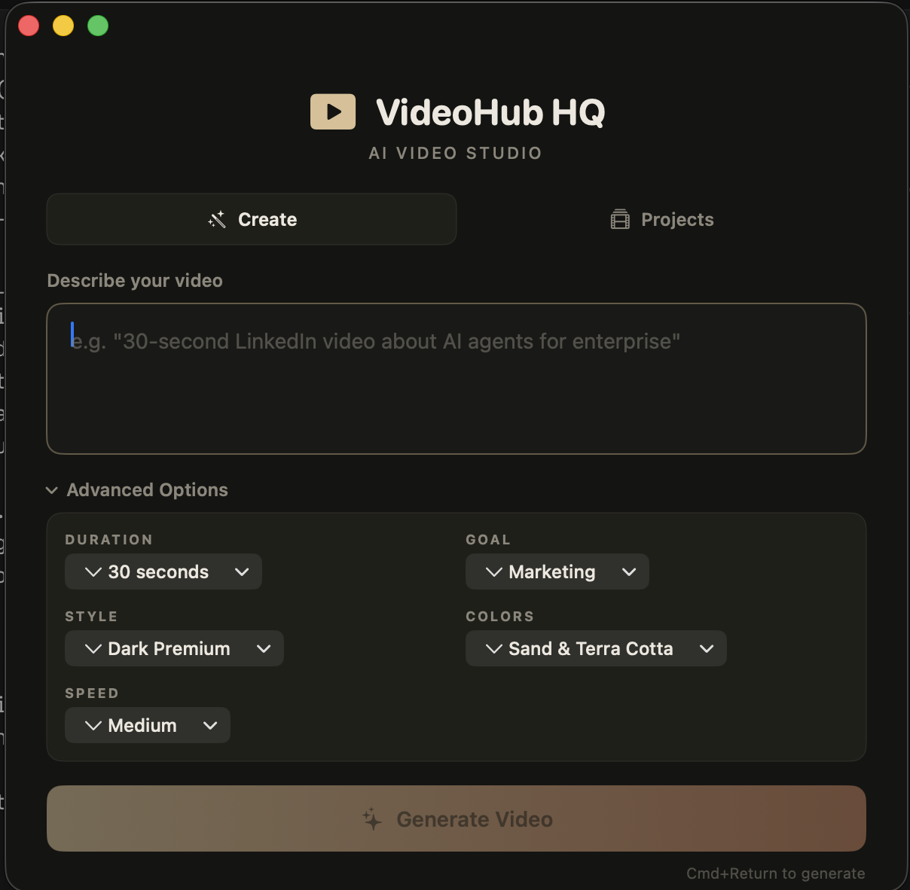
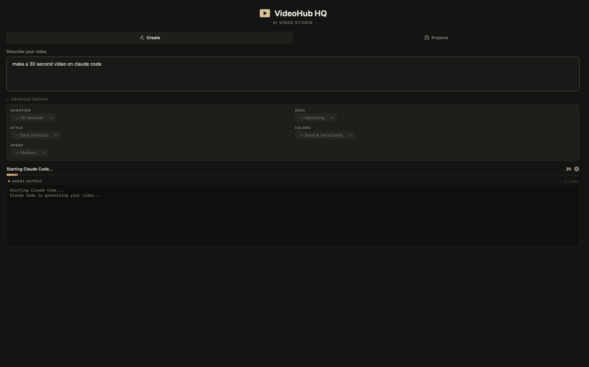

# VideoHub HQ

A native macOS app for creating AI-powered videos with [Claude Code](https://claude.ai/code) and [HyperFrames](https://github.com/heygen-com/hyperframes).

Type a prompt, hit Generate, and Claude Code builds a full HyperFrames video composition -- scenes, GSAP animations, transitions, typography, and all.


---

## Two Ways to Use VideoHub

### 1. In-App (GUI)

Launch VideoHub HQ, type a prompt, customize with advanced options, and hit **Generate Video**. The app handles the entire pipeline:

1. Scaffolds a HyperFrames project
2. Builds HTML compositions with GSAP animations via Claude Code
3. Validates with `hyperframes lint`
4. Auto-captures key frame thumbnails
5. Opens a dark-themed preview with HyperFrames Studio + thumbnail sidebar

### 2. Claude Code CLI (Skill)

Install the VideoHub skill and tell Claude Code to make videos directly from the terminal:

```bash
npx skills add gked2121/videohub-hq
```

Then in Claude Code:

```
> Use VideoHub to make a 30-second LinkedIn video about managed AI agents
```

Claude Code follows the full VideoHub pipeline automatically -- scaffold, compose, lint, snapshot, preview. Open the result in VideoHub HQ for preview and thumbnail management.

---

## Features

- **AI Video Generation** -- Describe your video in plain text. Claude Code generates a complete HyperFrames project with HTML compositions, GSAP animations, and transitions.
- **Advanced Prompt Options** -- Fine-tune your video with dropdowns for duration (15s-90s), goal (marketing, demo, explainer...), visual style (6 palettes), color scheme, and animation speed.
- **Real-Time Progress Bar** -- Watch generation progress with a visual progress bar that tracks milestones (scaffolding, composing, animating, validating) and percentage complete.
- **Live Agent Output** -- Streaming terminal output shows exactly what Claude Code is doing as it builds your project.
- **Auto-Thumbnails** -- After generation, automatically captures key frame PNGs via `hyperframes snapshot` and displays them in the success card.
- **Unified Preview** -- Dark-themed preview page with HyperFrames Studio (left) + thumbnail sidebar (right), auto-play on load.
- **Recent Projects** -- Your last 10 projects are saved for quick relaunch. Double-click to preview.
- **Onboarding** -- First-launch overlay explains all features and shows how to install the CLI skill.
- **Keyboard Shortcuts** -- Cmd+Return to generate. No mouse required.
- **Dark Theme** -- Sand and terra cotta accents on dark backgrounds. No purple.

## Prerequisites

- **macOS 13+** (Ventura or later)
- [Claude Code](https://docs.anthropic.com/en/docs/claude-code/overview) installed (`npm install -g @anthropic-ai/claude-code`)
- [HyperFrames](https://github.com/heygen-com/hyperframes) available via npx (`npx hyperframes`)
- Node.js 18+

## Quick Start

```bash
git clone https://github.com/gked2121/videohub-hq.git
cd videohub-hq
./build.sh
```

The app lands on your Desktop. Double-click to launch.

To compile manually:

```bash
swiftc -o VideoHubHQ VideoHubHQ.swift -framework SwiftUI -framework AppKit -parse-as-library
```

Then package into a `.app` bundle (see `build.sh` for the full structure).

## How It Works

### In-App Flow

1. **Type a prompt** -- e.g. "30-second LinkedIn video about AI agents for enterprise"
2. **Set advanced options** (optional) -- expand the Advanced Options panel to set duration, goal, style, colors, and animation speed
3. **Generate** -- Claude Code runs headlessly via `claude --print`, creates HTML compositions with GSAP animations
4. **Watch progress** -- real-time progress bar + streaming agent output show exactly what's happening
5. **Thumbnails captured** -- `hyperframes snapshot` runs automatically after generation, key frames displayed in the success card
6. **Preview** -- hit Preview to open the dark-themed viewer with HyperFrames Studio + thumbnail sidebar

### CLI Flow

1. **Install the skill** -- `npx skills add gked2121/videohub-hq`
2. **Tell Claude Code** -- "Use VideoHub to make a 45-second product demo video"
3. **Claude follows the pipeline** -- scaffold, compose, validate, snapshot, preview
4. **Open in VideoHub HQ** -- use the Projects tab to preview and manage thumbnails

Generated projects are saved to `~/Desktop/videohub-projects/`.

## VideoHub Skill

The VideoHub skill (`videohub/videohub.md`) teaches Claude Code how to build polished HyperFrames video compositions. It includes:

- Full 7-step pipeline (scaffold, plan, build, validate, snapshot, preview, render)
- HTML composition structure and rules
- Background layer requirements (radial glows, ghost text, accent lines, geometric shapes)
- Motion and animation rules (GSAP durations, easing, staggering)
- Typography guidelines (serif + sans-serif mixing, weights, sizes)
- 6 color palettes with hex codes (Dark Premium, Clean Corporate, Bold Energetic, Warm Editorial, Nature Earth, Monochrome)
- AI design tells to avoid (gradient text, neon glows, identical card grids)

Install it:

```bash
npx skills add gked2121/videohub-hq
```

## Screenshots

| Create Tab + Advanced Options | Generating with Progress Bar |
|---|---|
|  |  |

## Tech Stack

- **SwiftUI** -- native macOS app, instant launch, smooth animations
- **Claude Code CLI** -- AI-powered code generation running as a subprocess
- **HyperFrames + GSAP** -- HTML-to-video rendering framework by HeyGen
- Dark UI with warm earth tones (sand, terra cotta)

## Project Structure

```
videohub-hq/
  VideoHubHQ.swift   -- Single-file SwiftUI app (entire source)
  Info.plist         -- macOS app bundle metadata
  build.sh           -- Build + package script
  videohub/          -- Claude Code skill
    videohub.md      -- Full VideoHub pipeline & composition guide
  LICENSE            -- MIT
```

## License

MIT
